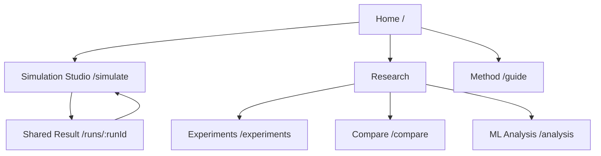

# Mosaic — Frontend Polish & UX Enhancement Plan

## Objective

Elevate Mosaic from a functional research application into a premium, research-grade interactive product without changing its research scope, simulation model, API contracts, or core page set.

The design source of truth remains [project-docs/design.md](project-docs/design.md): white Paper surfaces, Ink structure, Hairline borders, Inter Variable, 8px control radii, 16px card radii, and Signal Blue only for primary actions, active state, and the logo mark.

The 21st.dev references supplied for this plan are a component-catalog reference only. Their dark visual treatment must not be imported into Mosaic.

## Executive summary

Mosaic has the right product surface: a landing page, Simulator, shareable runs, experiments, comparison, ML analysis, and method guide. The polish opportunity is to make each of these surfaces feel more deliberate.

The main work is not adding pages. It is:

1. Make the Simulator the unmistakable primary destination.
2. Turn a completed run into a short scientific story before showing detailed views.
3. Reduce visual competition among configuration, metrics, charts, and raw data.
4. Standardize feedback, navigation, data controls, and progressive disclosure.
5. Make the research legible to newcomers without reducing technical accuracy.
6. Apply subtle, purposeful motion and strong accessibility behavior.

## Current information architecture

| Route | Purpose | Recommendation |
|---|---|---|
| `/` | Landing page | Keep; add a restrained completed-run preview. |
| `/simulate` | Simulation Studio | Keep; make it the primary product experience. |
| `/runs/:runId` | Shared, read-only run | Keep; preserve as a reproducibility surface. |
| `/experiments` | Offline research archive | Keep; convert from figure gallery to guided case studies. |
| `/compare` | Saved-run comparison | Keep; foreground configuration differences. |
| `/analysis` | Offline ML benchmark | Keep; lead with conclusion and limitations. |
| `/guide` | Method explanation | Keep; expand using short, preset-linked accordions. |

## Proposed sitemap and navigation



### Navigation changes

Use these desktop pill-nav items:

- Mosaic logo
- Simulator
- Research (popover: Experiments, Compare runs, ML analysis)
- Method
- Primary CTA: Run a simulation

This preserves every current page while reducing five competing top-level choices. Do not show shared results in primary navigation. On mobile, keep the CTA visible and open the other links in a compact dialog or sheet.

## UX audit

| Area | Current issue | UX impact | Recommendation | Priority |
|---|---|---|---|---|
| Navigation | Too many peer-level links | First-time users may not know where to begin | Group research pages under one popover | Critical |
| Landing | Explains the project but does not preview a useful result | Value is abstract before first run | Add a small “A run at a glance” evidence panel | High |
| Controls | All parameters have similar weight | High cognitive load before a user has a question | Group into Question, Network, Dynamics, Reproducibility | Critical |
| Presets | No expected-outcome explanation | Users cannot confidently choose one | Add outcome-oriented descriptions | High |
| Loading | Shows waiting but not model stage | Feels opaque | Stage copy: Build network, Simulate, Prepare views | High |
| Results | Metrics do not form an immediate conclusion | Users must infer what happened | Add generated result statement above metrics | Critical |
| Tabs | Related evidence is isolated | Users may miss network/trajectory relationship | Compose Overview from all three evidence types | High |
| Network | Reading guide and selected-agent focus are weak | Graph can be decorative rather than informative | Add legend, graph controls, inspector, and data table | Critical |
| UMAP | Raw timestep slider lacks narrative stages | Projection feels abstract | Use Initial, Early, Mid-run, Final labels | High |
| Experiments | Figures lack case-study hierarchy | Archive feels like a file browser | Question → method → finding → evidence | High |
| Comparison | Parameters and trajectories need stronger interpretation | Users can draw causal conclusions from mixed comparisons | Controlled/mixed status and highlighted differences | High |
| ML Analysis | Caveats are text-heavy | Visitors may overinterpret benchmark results | Conclusion first, table second, method detail later | High |
| Error handling | Error states lack recovery options | Users may get stuck | Try again, reset baseline, and field guidance | Critical |
| Accessibility | Graph/chart alternatives exist but selection and keyboard paths need work | Lower usability for keyboard and screen-reader users | Inspector, live regions, table summaries, tab keyboard support | Critical |

## Simulator redesign

### Design intent

The Simulator should feel like a scientific instrument: focused, quiet, and explanatory. It should lead users from a question to assumptions, then from a result to evidence.

### Desktop layout

```text
┌─────────────────────────────────────────────────────────────┐
│ Floating navigation                                           │
├─────────────────────────────────────────────────────────────┤
│ Simulator title · concise question · preset indicator         │
├───────────────────┬─────────────────────────────────────────┤
│ Configuration     │ Run canvas                               │
│ Question          │ Before run: guided empty state           │
│ Network           │ After run: result statement              │
│ Dynamics          │            metric strip                  │
│ Reproducibility   │            overview + detailed tabs      │
│ Run simulation    │                                         │
└───────────────────┴─────────────────────────────────────────┘
```

### Before a run

Use a focused empty state:

**Start with a question**

“Choose a preset to see a known pattern, or configure a network from first principles.”

Present three selectable preset cards:

| Preset | Description | Expected observation |
|---|---|---|
| Small-world baseline | Local clusters with occasional shortcuts | Diversity can persist in a connected network. |
| Hub influence | Scale-free network with stronger prestige | Highly connected speakers can shape the final pattern. |
| Two-community contact | Two communities connected by bridge ties | More bridges generally accelerate merger. |

Selecting a preset sets the form and focuses the Run button. It does not run automatically.

### During a run

Use an indeterminate, accessible stage sequence:

1. Building the social network
2. Simulating speaker interactions
3. Preparing metrics and visualizations

Do not use fabricated percentage progress.

### Completed run

Place a generated result statement directly below the run header.

Examples:

- “The population did not reach the convergence criterion within 10,000 steps, retaining measurable accent diversity.”
- “The simulation converged after 4,300 steps; final pairwise accent distance was low.”
- “The final network contains distinct accent clusters despite a connected social structure.”

Then show metric cards in this order:

1. Run status
2. Convergence time
3. Final diversity
4. Pairwise distance

Emphasize only the metric most relevant to the outcome.

### Overview tab

The Overview should answer three questions before the user opens another tab:

1. Did the population converge?
2. How did diversity and distance change?
3. What does the final state look like?

Structure:

- Result statement
- Metric strip
- Full-width time-series chart
- Network and UMAP preview cards
- Text actions to open detailed views
- “How to interpret this run” accordion

### Network tab

Include:

- Title: Final social network
- Legend for node size, accent cluster, and community
- Reset view, toggle labels, and open-data controls
- Selected-agent inspector with ID, community, centrality, cluster, and six accent dimensions
- Accessible table disclosure

### Accent Space tab

Replace raw index semantics with named stages:

- Initial state
- Early interaction
- Mid-run
- Final state

Keep exact timestep as secondary metadata. Explain that UMAP is a mathematical projection, not a geographic map.

### Reproducibility tab

Order content as follows:

1. JSON and CSV export
2. Run ID, configuration fingerprint, and seed
3. Duplicate configuration
4. Raw snapshot playback
5. Full configuration table

## Page-by-page improvements

### Home

- Retain one 62px display heading only.
- Add a compact “What a run produces” panel with a tiny metric summary, network thumbnail, and interpretation sentence.
- Replace generic feature cards with research questions: topology, hub influence, and community contact.
- End with an understated research credibility section linking to Experiments and ML Analysis.

### Experiments

Turn every experiment into a case study:

1. Research question
2. Experimental setup metadata
3. One-sentence finding
4. Figure evidence
5. Figure caption and “How to read this” accordion
6. Figure download action

Use filter pills for All findings, Topology, Prestige, Community contact, and Validation.

### Compare

- Detect and label comparisons as Controlled (one parameter differs) or Mixed (multiple differences).
- Add an “Only show differences” switch for configuration tables.
- Highlight changed fields using Ink/Hairline treatment, not colored fills.
- Include a conclusion panel that describes observed differences without claiming causation for mixed comparisons.
- Normalize an optional second trajectory chart only when raw timelines have incompatible endpoints.

### ML Analysis

Recommended order:

1. Question: What predicts final accent clusters?
2. Plain-language conclusion
3. Benchmark table: model, accuracy, macro F1, difference from chance
4. Dataset metadata
5. Clustering diagnostic cards
6. Figures
7. Method and limitations accordions

State clearly that the MLP outperformed the tested GCN in this synthetic benchmark and that the k-means partition is a useful but weak discretization of a continuum.

### Method

Use five short accordions:

1. What is an agent?
2. How do speakers influence one another?
3. How does the network matter?
4. What do the metrics mean?
5. What Mosaic does not model

Each section should link to a relevant simulator preset where useful.

## Visual design direction

### Typography

- Eyebrow: 12px, 600, Ash
- Page title: 32px or 62px depending on page purpose
- Section title: 20–24px, 600
- Body: 14–16px, Graphite
- Metadata: 12px, Ash
- Keep explanatory text to roughly 60–75 characters per line

### Spacing and surfaces

- Use 128px for major page sections and 16px inside cards.
- Use 8px only for tightly related controls.
- Prefer Hairline borders over shadows.
- Use the XL shadow for at most one hero-adjacent feature card per page.
- Do not add gradients, tinted surfaces, dark mode, or colored shadows.

### Data visualization

- Signal Blue: selected/primary series only
- Ink: structural series and axes
- Graphite/Ash: secondary series and grid
- Ember, Amber, Crimson, Deep Signal: categories inside data views only
- Pair categorical colors with labels, marker shapes, or data tables
- Use Paper tooltips with Hairline border and 8px radius

## Component inventory and 21st.dev adoption

Use 21st.dev as a source of accessible behavior and component composition, not as a visual theme. Map every primitive to Mosaic’s tokens.

| Component | Current state | Keep custom? | 21st.dev category | Recommendation |
|---|---|---:|---|---|
| Floating navigation | Custom | Yes | Navigation Menus, Menus | Keep shell; add accessible Research popover and mobile menu behavior. |
| Hero | Custom | Yes | Heroes, Texts | Keep custom; improve copy and evidence preview. |
| Buttons | Custom classes | Mostly | Buttons | Retain visual style; adopt loading, icon, pressed-state behavior. |
| Metric cards | Custom | Mostly | Cards, Numbers | Keep domain-specific cards; improve hierarchy and optional count-up. |
| Configuration form | Custom | Yes | Forms, Sliders, Selects, Sidebars | Keep logic; adopt polished field and sheet patterns. |
| Preset chooser | Select | No | Radio Groups, Cards, Selects | Replace with outcome-oriented card/radio pattern. |
| Mobile configuration | Native dialog | Mostly | Dialogs/Modals | Keep or replace only for better focus and sheet transitions. |
| Result tabs | Custom buttons | No | Tabs | Use an accessible tabs primitive while retaining Mosaic styling. |
| Tooltips | Inconsistent/native titles | No | Tooltips | Add keyboard-accessible metric and chart tooltips. |
| Network graph | D3 | Yes | N/A | Keep custom; add inspector, legend, and controls. |
| UMAP | D3 | Yes | N/A | Keep custom; replace raw slider with stage selector. |
| Charts | Recharts | Yes | Charts | Keep custom data layer; standardize legend/tooltip states. |
| Tables | Native | Yes | Tables | Keep semantic tables; use responsive wrappers and compact density. |
| Empty states | Custom | No | Empty States | Standardize icon, title, explanation, and action. |
| Errors | Notice panel | No | Alerts, Toasts | Add field-level recovery and global alerts. |
| Toasts | Missing | No | Toasts | Use for copy link, export confirmation, and saved draft feedback. |
| Loading | Spinner | Mostly | Spinner Loaders, Skeletons | Add skeletons for panels and research figures. |
| Accordions | Native details | Mostly | Accordions | Preserve native behavior unless motion/accessibility meaningfully improves. |
| Command palette | Missing | Optional | Menus, Dialogs | Add only after core polish if navigation testing warrants it. |

## Motion plan

Use one modern animation library only: Motion for React. Continue using CSS transitions for simple hover and focus behavior.

| Interaction | Motion | Purpose |
|---|---|---|
| Route changes | 160ms fade + 4px settle | Preserve orientation. |
| Research popover | 140ms opacity + 0.98 scale | Make grouped navigation discoverable. |
| Preset selection | 120ms border/label transition | Confirm user intent. |
| Button press | Scale to 0.98 over 100ms | Provide tactile feedback. |
| Result appearance | Metrics, then overview panels | Establish reading order. |
| Metric value | One count-up under 500ms | Help users notice new outcomes. |
| New chart | 300ms line draw | Show that evidence arrived. |
| UMAP stage change | 180ms point interpolation | Clarify evolution. |
| Network graph | Quick force settling, then stop | Avoid visual noise. |
| Dialog/sheet | 200ms translate + fade | Maintain spatial context. |

All motion must respect `prefers-reduced-motion`. Do not use continuous network motion, parallax, or decorative animation.

## Content improvements

| Current intent | Recommended copy |
|---|---|
| Agents | Speakers |
| Maximum steps | Maximum interactions |
| Prestige weight | Prestige influence |
| Confidence bound | Similarity threshold |
| Phonetic drift | Random drift |
| Random seed | Reproducibility seed |
| Empty state | Start with a question |
| UMAP title | Accent evolution |
| Data tab | Reproducibility and raw data |
| Duplicate action | Use this configuration |

Suggested helper text:

- “How many simulated speakers take part.”
- “The run stops early when diversity stabilizes.”
- “How much extra influence highly connected speakers receive.”
- “Speakers only accommodate when their accents are close enough.”
- “Reuse this value with the same configuration to reproduce a run.”

## Accessibility and responsive requirements

### Accessibility

- Every visualization needs a programmatic title, concise summary, keyboard-accessible controls, and semantic table/text alternative.
- Use live regions for run status, errors, copied-link feedback, and UMAP completion.
- Implement arrow-key tab behavior and focus management.
- Provide an inspector for network selection; do not rely on hover.
- Ensure dialogs trap and restore focus and close with Escape.
- Verify Graphite/Ash contrast at actual display sizes.
- Test 200% zoom and reduced-motion preference.

### Responsive behavior

| Width | Behavior |
|---|---|
| ≥1440px | 1200px centered canvas, fixed control rail, broad data canvas. |
| 1024–1439px | Narrower rail, two-column overview previews, compact navigation. |
| 768–1023px | Configuration becomes a sheet/dialog; result workspace is single-column. |
| <768px | One-column results; full-width chart controls; contained horizontal table scroll. |

Mobile completed-run order:

1. Result statement
2. Metrics
3. Timeline
4. Network
5. Accent evolution
6. Reproducibility/export
7. Raw data

## Implementation priorities

### Critical

1. Rework Simulator hierarchy around result statement, metric strip, composed Overview, and staged controls.
2. Add selected-agent inspector, chart summaries, tab keyboard behavior, and error recovery.
3. Simplify navigation through a Research grouping.
4. Standardize tabs, tooltips, toasts, dialogs, skeletons, and empty states.
5. Consolidate token-aligned component styles and remove duplicated inline styling.

### High

1. Convert experiments into question → finding → evidence case studies.
2. Add controlled/mixed comparison status and highlighted differences.
3. Reframe ML Analysis around conclusion, benchmark table, and limitations.
4. Add expected-outcome descriptions to presets.
5. Improve mobile result layouts and chart controls.

### Medium

1. Expand Method into concise accordions.
2. Add a minimal research footer.
3. Add figure download/share actions.
4. Add a local recent-runs strip on Simulator.

### Low

1. Metric count-up motion.
2. Route transitions.
3. Command palette, only if user testing shows a real need.

## Definition of done

This polish phase is complete when:

- A new user can reach a meaningful first run within one minute.
- A result explains its outcome before the user opens detailed tabs.
- Every chart and graph explains itself and has an accessible alternative.
- Research pages communicate findings, methods, and limitations without forcing users to decode raw figures.
- Motion is subtle, useful, and reduced-motion safe.
- 21st.dev/shadcn primitives follow Mosaic’s existing light design language.
- Mosaic remains recognizably itself: white canvas, Ink structure, Hairline borders, Inter Variable, and one Signal Blue action.
