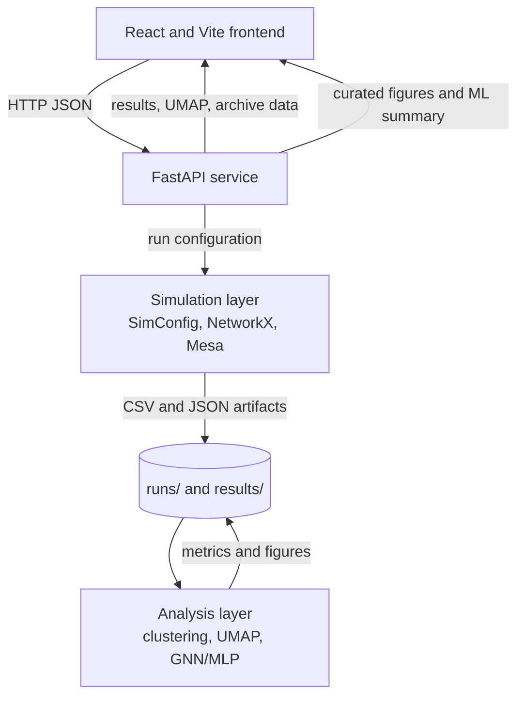
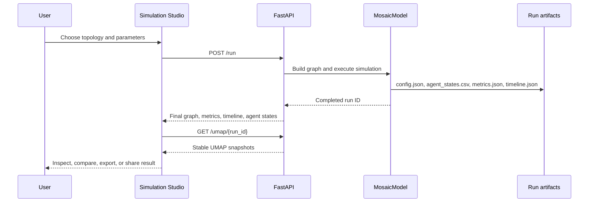

# Mosaic

People change how they speak depending on who they talk to. Over time, those small shifts accumulate into dialects: whole communities that sound like each other and different from everyone else. Mosaic simulates that process.

Give it a population of speakers, a social network, and a set of rules about who influences whom. Watch accents drift, cluster, and either converge or hold their ground, depending on how the network is shaped.

Built with Python, Mesa, NetworkX, and PyTorch, Mosaic is analyzed with graph-based machine learning and explored through a full-stack React web interface.

## What Mosaic does

- Builds a population of simulated speakers connected by one of four social-network structures.
- Lets speakers gradually accommodate to connected neighbours when their accents are sufficiently similar.
- Measures diversity, average accent distance, convergence, and community contact over time.
- Provides an interactive web interface for running, inspecting, exporting, and comparing simulations.
- Includes completed experiment figures and an offline machine-learning benchmark.

## How it works

Each simulated speaker has six values representing simplified phonetic features, such as vowel formants, voice onset time, and speaking rate. At each timestep, Mosaic selects one pair of connected speakers. The listener may shift slightly toward the speaker's accent.

Three controls shape that shift:

| Control | Plain-language effect |
|---|---|
| Network topology | Determines who can interact and whether hubs or communities emerge. |
| Prestige weight | Gives highly connected speakers more influence when it is increased. |
| Confidence bound | Prevents accommodation between speakers whose accents are too different. |

Over many interactions, Mosaic records whether the population becomes more alike, retains distinct groups, or gradually merges across community boundaries.

## Research questions

1. How does network topology affect the rate and final pattern of accent convergence?
2. Does centrality-based prestige change which speakers influence the population?
3. Can final accent-cluster membership be predicted from initial simulation state?

## System architecture



## Simulation workflow



## Technical model

Each agent has an accent vector `a` in `[0, 1]^6`. For a sampled network edge, the listener updates toward the speaker only when the Euclidean accent distance is below the confidence bound `theta`.

```text
if ||a_speaker - a_listener|| < theta:
    a_listener = clip(
        a_listener + gamma * centrality(speaker) * (a_speaker - a_listener)
        + Normal(0, sigma^2),
        0, 1,
    )
```

The model logs accent states every `log_every` steps and stops when consensus is reached (noiseless), a stationary equilibrium is found (noisy), or when it reaches the maximum timestep.

### Network topologies

| Topology | Parameters | Intended structure |
|---|---|---|
| Erdős-Rényi | `p_er` | Random ties with low clustering. |
| Watts-Strogatz | `k_ws`, `p_rewire` | Small-world graph with local clusters and shortcuts. |
| Barabási-Albert | `m_ba` | Scale-free graph with influential hubs. |
| Stochastic Block Model | `p_in`, `p_out` | Two communities with controllable bridging ties. |

### Primary outputs

| Output | Meaning |
|---|---|
| Shannon diversity | Distribution of k-means accent clusters over time. |
| Mean pairwise distance | Average distance between agent accent vectors. |
| Convergence time | First stable diversity point under the model criterion. |
| Final network state | Network nodes, centrality, community IDs, and final accent clusters. |
| UMAP snapshots | Four aligned 2D views of accent-space evolution. |

## Application features

The web application provides the following routes:

| Route | Purpose |
|---|---|
| `/` | Project overview and entry point. |
| `/simulate` | Schema-driven simulation configuration and execution. |
| `/runs/:runId` | Deep-linkable result view. |
| `/experiments` | Curated offline experiment archive. |
| `/compare` | Configuration comparison and diversity-trajectory overlays. |
| `/analysis` | Offline ML benchmark report. |
| `/guide` | Concise explanation of the method and metrics. |

Completed runs support permalink copying, configuration duplication, JSON/CSV export, UMAP inspection, raw agent-state snapshot playback, and accessible tables for network and chart data.

## Results and interpretation

The stored ML benchmark reports the following values:

| Measure | Result |
|---|---:|
| MLP accuracy | 89.18% |
| MLP macro F1 | 89.55% |
| GCN accuracy | 51.08% |
| GCN macro F1 | 50.35% |
| Random baseline | 20.00% |
| k-means silhouette | 0.0895 |
| DBSCAN clusters | 1 |

The MLP outperforms the GCN on this synthetic benchmark. This indicates that initial node features are more predictive than graph convolution under the current data-generation and labeling setup; it is not a general claim about real-world accent change.

## Project structure

```text
Mosaic/
├── simulation/       Core ABM: configuration, network, agents, model, metrics, logging
├── analysis/         Clustering, UMAP, GNN/MLP training, evaluation
├── experiments/      Topology, prestige, contact, ablation, S-curve, heatmap experiments
├── viz/              Publication-oriented matplotlib/seaborn figures and GIF generation
├── api/              FastAPI application and Pydantic schemas
├── frontend/         React, TypeScript, Vite, D3, and Recharts application
├── runs/             Per-run artifacts; generated locally
├── results/          Aggregate metrics, ML summary, and generated figures
├── tests/            Simulation and API test suite
├── docs/             Background research reports and academic literature review
└── project-docs/     Product, model, architecture, experiment, ML, and design documents
```

## Installation

### Prerequisites

- Python 3.11 or later
- Node.js 18 or later
- Git

```bash
git clone https://github.com/AdityaWagh19/Mosaic.git
cd Mosaic

python -m venv .venv
```

Activate the environment:

```bash
# Windows PowerShell
.venv\Scripts\Activate.ps1

# macOS or Linux
source .venv/bin/activate
```

Install the Python requirements:

```bash
pip install -r requirements.txt
```

`requirements.txt` documents the additional PyTorch and PyTorch Geometric installation commands required for the ML analysis environment.

## Running the application

Start the backend in one terminal:

```bash
python -m uvicorn api.main:app --reload --port 8000
```

Start the frontend in another terminal:

```bash
cd frontend
npm install
npm run dev
```

Open `http://localhost:5173`. The FastAPI interactive documentation is available at `http://localhost:8000/docs`.

To point the frontend at a different API host, define `VITE_API_BASE_URL` before running Vite.

## API reference

| Method | Path | Description |
|---|---|---|
| `POST` | `/run` | Run one simulation and return the complete result payload. |
| `GET` | `/results/{run_id}` | Retrieve a completed run. |
| `GET` | `/umap/{run_id}` | Retrieve cached or computed UMAP snapshots. |
| `GET` | `/topologies` | List topologies and conditional parameters. |
| `GET` | `/config/schema` | Return UI labels, ranges, help text, and defaults. |
| `GET` | `/runs` | List local run summaries with optional cursor and topology filter. |
| `GET` | `/runs/{run_id}/export` | Download JSON or agent-state CSV. |
| `GET` | `/runs/{run_id}/snapshots` | Retrieve recorded agent-state snapshots. |
| `GET` | `/experiments` | List the offline experiment archive. |
| `GET` | `/experiments/{experiment_id}` | Retrieve one archive entry. |
| `GET` | `/figures/{filename}` | Serve an allowlisted research figure. |
| `GET` | `/analysis/summary` | Return ML benchmark metrics and available figures. |

## Running experiments and analysis

```bash
# One default Monte Carlo batch
python -m simulation.runner

# All planned experiments
python -m experiments.run_all

# ML evaluation and research figures
python -m analysis.evaluate
```

Generated figures are written to `results/figures/`. Per-run artifacts are written under `runs/`.

## Testing and validation

```bash
pytest tests/ -v

cd frontend
npm run build
```

The Python suite covers configuration, network generation, agent updates, model convergence, metrics, and API integration. The frontend build runs TypeScript checking and produces a production bundle.

## Documentation

| Document | Contents |
|---|---|
| `project-docs/context.md` | Project rationale, research questions, and scope. |
| `project-docs/model.md` | Mathematical model and metric definitions. |
| `project-docs/architecture.md` | Module responsibilities and API architecture. |
| `project-docs/experiments.md` | Experimental protocol and expected figures. |
| `project-docs/ml-pipeline.md` | Data, models, evaluation, and scientific interpretation. |
| `project-docs/design.md` | Frontend visual system. |
| `project-docs/frontend-implementation-plan.md` | Frontend architecture and delivery plan. |

## Scope

Mosaic models synthetic accent vectors and social-network interactions. It does not process speech audio, infer real-world dialect identity, represent specific populations, or provide multi-user collaboration.

## License

MIT License.
