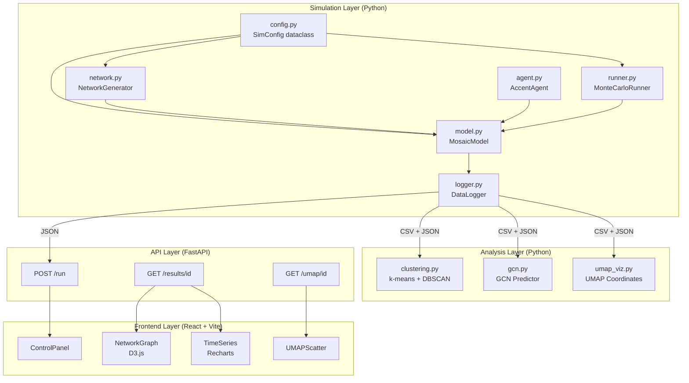
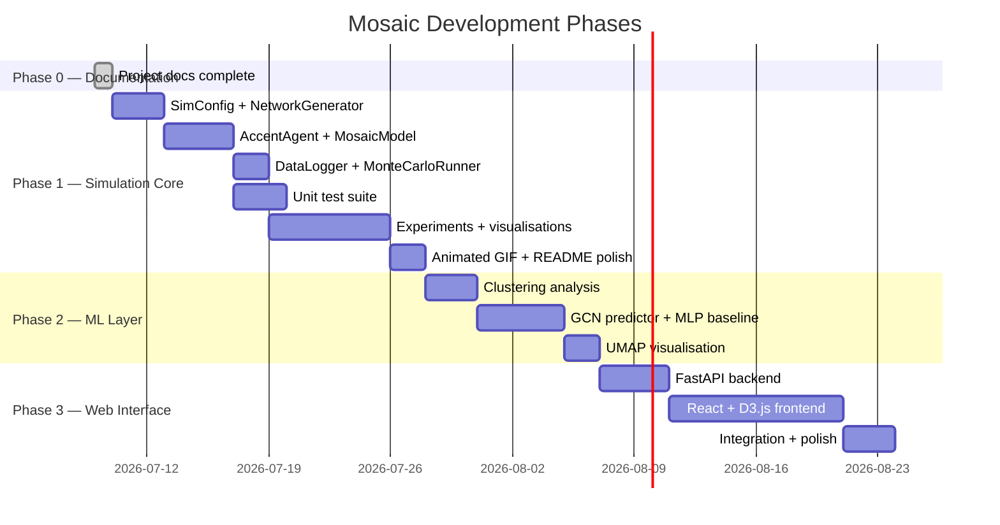

# Mosaic

People change how they speak depending on who they talk to. Over time, those small
shifts accumulate into dialects — whole communities that sound like each other and
different from everyone else. Mosaic simulates that process.

Give it a population of speakers, a social network, and a set of rules about who
influences whom. Watch accents drift, cluster, and either converge or hold their
ground — depending entirely on how the network is shaped.

Built with Python (Mesa, NetworkX, PyTorch), analyzed with a Graph Convolutional
Network, and explored through a custom React web interface.

---

## How It Works

Each agent holds a 6-dimensional accent vector representing real phonetic features
(vowel formants, voice onset time, speaking rate). At every timestep, two connected
agents have a conversation. The listener shifts their accent slightly toward the
speaker — but only if they are socially similar enough, and weighted by how
influential the speaker is.

Run this for thousands of interactions across hundreds of agents, and dialect zones
emerge on their own. No rules about which accent "wins" — just local interactions
producing global structure.

---

## Research Questions

**RQ1 — Topology:**
How does the shape of the social network affect how quickly and completely accents converge?

**RQ2 — Prestige:**
Do well-connected speakers — the social hubs — actually drive more accent change than peripheral ones?

**RQ3 — Predictability:**
Can a Graph Convolutional Network predict where an agent's accent will end up, just from their starting position in the network?

---

## System Architecture

Three independent layers — build and test each in isolation.



| Layer | Phase |
|---|---|
| Simulation | Phase 1 |
| Analysis + ML | Phase 2 |
| API + Frontend | Phase 3 |

---

## Network Topologies

Four social network structures, each producing qualitatively different dynamics.

| Topology | Structure | What it produces |
|---|---|---|
| Erdos-Renyi | Random edges | Moderate convergence, high run-to-run variance |
| Watts-Strogatz | High local clustering, short paths | Preserves local dialect diversity; slow global spread |
| Barabasi-Albert | Power-law degree, few dominant hubs | Fast convergence driven by influential speakers |
| Stochastic Block Model | Two explicit communities | Two-phase convergence: fast within, slow between communities |

---

## Technology Stack

| Layer | Technology |
|---|---|
| Agent-based model | Mesa, NetworkX, NumPy |
| Data pipeline | pandas |
| Machine learning | PyTorch, PyTorch Geometric |
| Dimensionality reduction | umap-learn |
| Visualisation | matplotlib, seaborn |
| API backend | FastAPI, uvicorn |
| Frontend | React, Vite, D3.js, Recharts |
| Testing | pytest |

---

## Project Structure

```
mosaic/
├── simulation/
│   ├── config.py          # SimConfig — all parameters in one place
│   ├── network.py         # NetworkGenerator — four topologies
│   ├── agent.py           # AccentAgent — phonetic state + update rule
│   ├── model.py           # MosaicModel — edge-based scheduling + convergence
│   ├── logger.py          # DataLogger — CSV + JSON output per run
│   └── runner.py          # MonteCarloRunner — batch runs + aggregation
│
├── analysis/              # Phase 2
│   ├── clustering.py      # k-means + DBSCAN dialect zone discovery
│   ├── gcn.py             # GCN trajectory predictor
│   ├── umap_viz.py        # UMAP coordinate computation
│   └── shap_analysis.py   # SHAP feature importance (optional)
│
├── api/                   # Phase 3
│   ├── main.py
│   └── schemas.py
│
├── frontend/              # Phase 3
│   └── src/components/
│       ├── ControlPanel.jsx
│       ├── NetworkGraph.jsx
│       ├── TimeSeries.jsx
│       └── UMAPScatter.jsx
│
├── runs/                  # Auto-generated — one directory per run
├── results/               # Aggregated outputs and figures
├── tests/
├── notebooks/demo.ipynb
├── research/              # Background research reports
├── project-docs/          # Full project documentation
└── requirements.txt
```

---

## Installation

**Prerequisites:** Python 3.11+, Git

```bash
git clone https://github.com/AdityaWagh19/Mosaic.git
cd Mosaic
python -m venv .venv
.venv\Scripts\activate        # Windows
# source .venv/bin/activate   # macOS / Linux
pip install -r requirements.txt
```

---

## Usage

**Run a single simulation:**
```bash
python -m simulation.runner
```

**Run tests:**
```bash
pytest tests/ -v
```

**Run the web interface:**
```bash
# Terminal 1 — start the API
uvicorn api.main:app --reload

# Terminal 2 — start the frontend
cd frontend
npm install
npm run dev
# Open http://localhost:5173
```

**Programmatic use:**
```python
from simulation.config import SimConfig
from simulation.network import make_network
from simulation.model import MosaicModel
from simulation.logger import DataLogger

config = SimConfig(topology="watts_strogatz", N=200, T=10000, gamma=1.0, theta=0.30)
G = make_network(config)
model = MosaicModel(config, G)
metrics = model.run(DataLogger(config))

print(f"Converged at step {metrics['convergence_time']}")
print(f"Final diversity: {metrics['final_diversity']:.3f}")
```

---

## Documentation

All design decisions, specifications, and experiments are documented in `project-docs/`.

| Document | Contents |
|---|---|
| `context.md` | Project identity, research questions, non-goals |
| `model.md` | Full mathematical specification of the ABM |
| `architecture.md` | Module specs, API contract, frontend component map |
| `prd.md` | Functional requirements per phase |
| `mvp.md` | Phase 1 scope, build order, acceptance criteria |
| `tasks.md` | Living task tracker for all three phases |
| `experiments.md` | Pre-specified experimental design and metrics |
| `design.md` | Frontend design system and UI specification |
| `progress.md` | Running log of decisions and findings |

---

## Roadmap



---

## License

MIT License
