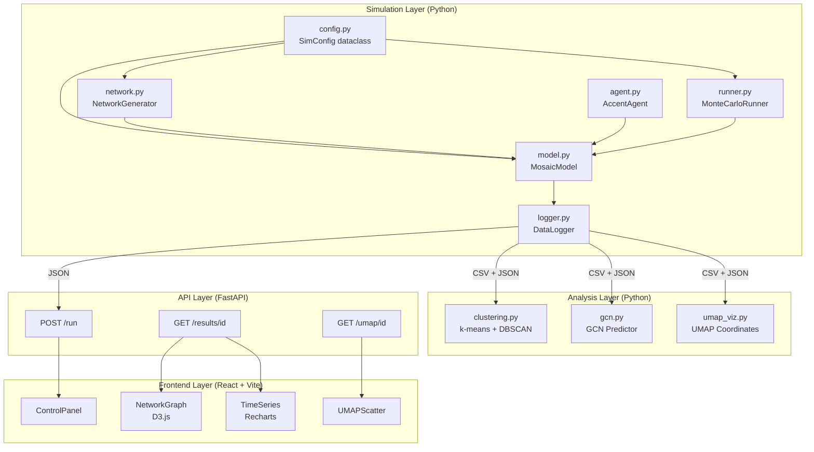
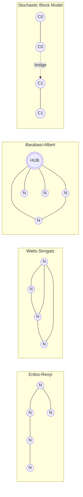
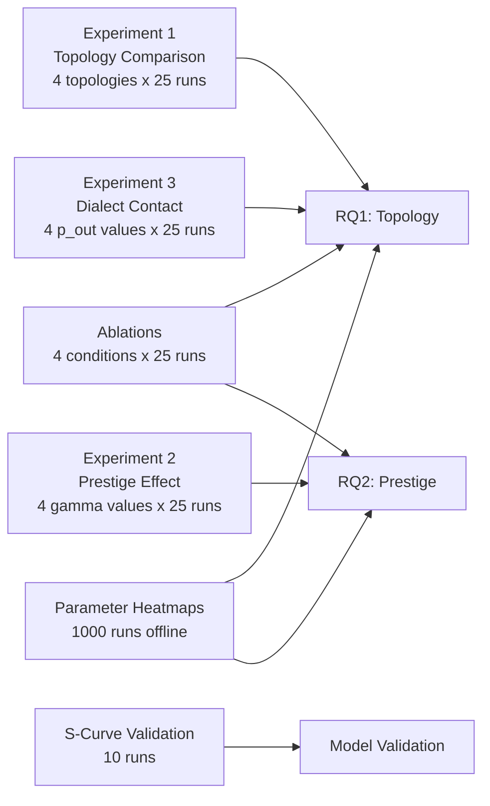
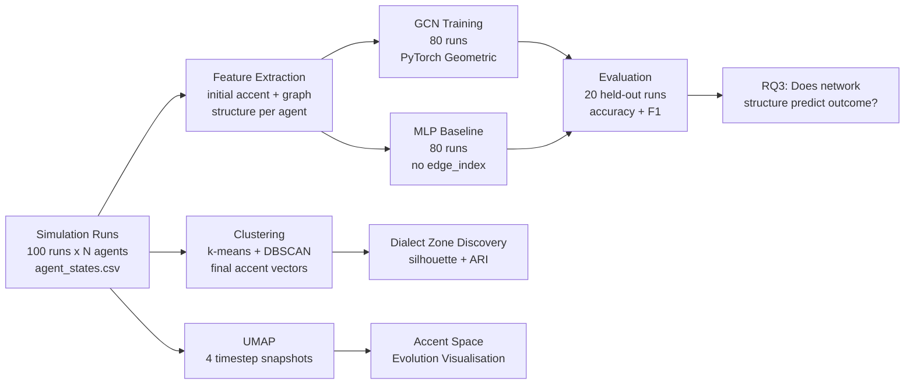

# Mosaic

A modular, research-inspired framework for simulating accent and dialect evolution
in socially-structured populations, integrating agent-based modelling, network
science, and graph neural networks into a unified Python system with a custom
interactive web interface.

---

## Table of Contents

- [Overview](#overview)
- [Research Questions](#research-questions)
- [System Architecture](#system-architecture)
- [Mathematical Model](#mathematical-model)
- [Network Topologies](#network-topologies)
- [Experiments](#experiments)
- [ML Pipeline](#ml-pipeline)
- [Technology Stack](#technology-stack)
- [Project Structure](#project-structure)
- [Installation](#installation)
- [Usage](#usage)
- [Documentation](#documentation)
- [Development Roadmap](#development-roadmap)
- [Theoretical Grounding](#theoretical-grounding)

---

## Overview

Accent and dialect change emerge from millions of individual conversations, not
from top-down linguistic rules. Mosaic models this process computationally:
a population of agents, each holding a phonetically-informed accent
representation, interact across a social network and gradually converge toward
or diverge from one another's speech patterns, depending on social structure,
prestige, and the topology of the network they inhabit.

The project occupies a gap in the current landscape. Existing agent-based models
of language change (Axelrod 1997, Buzato and Cunha 2024) use abstract trait labels
with no phonetic grounding. Empirical phonetic ML studies (Lesnichaia et al. 2022,
Gubian et al. 2023) model acoustic features in isolation from social network
structure. Mosaic is the first open-source framework to integrate
phonetically-informed accent representation, graph-structured social dynamics,
and a machine learning analytics pipeline in a single reproducible Python system.

---

## Research Questions

The project is built to address three concrete, answerable questions:

**RQ1 — Topology:**
How does social network structure (Erdos-Renyi, Watts-Strogatz, Barabasi-Albert,
Stochastic Block Model) affect the rate, pattern, and final diversity of accent
convergence across a population?

**RQ2 — Prestige:**
Do agents with higher network centrality (a proxy for social prestige) exert
greater influence over the direction of population-level accent change? Does the
prestige weighting parameter interact with topology?

**RQ3 — Predictability:**
Can a Graph Convolutional Network, trained on simulation outputs, predict an
agent's final accent cluster from its initial network position and accent vector
better than a structure-agnostic MLP baseline, demonstrating that network
topology carries predictive signal beyond raw agent features?

---

## System Architecture

Mosaic is organised into three independent layers. Each can be developed, tested,
and run in isolation.



### Phase Ownership

| Layer | Phase |
|---|---|
| Simulation | Phase 1 |
| Analysis (ML) | Phase 2 |
| API + Frontend | Phase 3 |

---

## Mathematical Model

### Agent State

Each agent holds a 6-dimensional accent vector **a** in R^6, where each
dimension corresponds to a named phonetic feature, normalised to [0, 1]:

| Index | Feature | Phonetic Meaning |
|---|---|---|
| 0 | F1 of /ae/ | First formant of the TRAP vowel |
| 1 | F2 of /ae/ | Second formant of the TRAP vowel |
| 2 | F1 of /a/ | First formant of the LOT vowel |
| 3 | F2 of /a/ | Second formant of the LOT vowel |
| 4 | VOT of /p/ | Voice Onset Time (stop aspiration) |
| 5 | Speaking rate | Normalised syllables per second |

### Update Rule

At each timestep, one edge (i, j) is sampled uniformly from the network. Agent i
(listener) updates its accent toward agent j (speaker) according to the
prestige-weighted asymmetric accommodation rule:

```
a_i(t+1) = a_i(t) + alpha_ij * (a_j(t) - a_i(t)) + epsilon

where:
    alpha_ij = gamma * centrality(j) * 1[||a_j - a_i|| < theta]
    epsilon  ~ N(0, sigma^2 * I)
```

| Parameter | Symbol | Default | Description |
|---|---|---|---|
| Prestige weight | gamma | 1.0 | Scales influence of degree centrality |
| Confidence bound | theta | 0.30 | Maximum accent distance for interaction |
| Noise standard deviation | sigma | 0.01 | Phonetic drift per update |

The indicator function enforces bounded confidence: agents only accommodate to
speakers whose accent is sufficiently similar to their own. The centrality term
encodes asymmetric prestige: higher-degree speakers exert proportionally stronger
influence over listeners.

### Convergence

Simulation terminates when Shannon diversity H(t) changes by less than
delta = 0.001 for 200 consecutive timesteps, or when the hard cutoff T = 10,000
is reached.

---

## Network Topologies



| Topology | Key Property | Characteristic Dynamic |
|---|---|---|
| Erdos-Renyi | Random edges, low clustering | Moderate convergence speed, high variance |
| Watts-Strogatz | High clustering + short paths | Preserves local diversity, slow global convergence |
| Barabasi-Albert | Power-law degree, hub agents | Hub-driven fast convergence |
| Stochastic Block Model | Explicit community structure | Two-phase convergence; dialect contact dynamics |

---

## Experiments



### Experiment 1 — Topology Comparison (RQ1)
Four topologies at fixed parameters, 25 Monte Carlo runs each. Measures final
Shannon diversity and convergence time. Produces diversity time series and
convergence boxplots.

### Experiment 2 — Prestige Effect (RQ2)
Barabasi-Albert network, four values of the prestige weight gamma. For each
agent, computes the Influence Residual Score: the negative distance between the
agent's initial accent and the final population centroid. A high score indicates
the population converged toward where that agent started. Spearman correlation
between centrality and influence score is reported per gamma condition.

### Experiment 3 — Dialect Contact (RQ1 extended)
Two-community Stochastic Block Model with four inter-community bridge densities.
Measures cross-community accent distance over time. Produces four-panel network
snapshots and distance decay curves.

### Ablation Studies
Four systematic ablations isolate the contribution of each model component:
no bounded confidence, no prestige weighting, no phonetic noise, and symmetric
interaction.

### Parameter Heatmaps
Systematic grid sweeps over (topology x theta) and (topology x gamma), 25 runs
per cell, generating convergence time and final diversity heatmaps. Pre-computed
offline; results committed as figures.

---

## ML Pipeline

The Phase 2 ML layer operates entirely on simulation outputs. No real speech
data is required.



The GCN takes as input a node feature matrix (6 accent dimensions + degree +
clustering coefficient + community id) and the graph edge structure. It predicts
the final k-means accent cluster label for each agent. If GCN accuracy exceeds
the MLP baseline, network topology is shown to carry predictive signal beyond
raw agent features. This directly answers RQ3.

The optional upgrade from GCNConv to GATConv (a single line change in
PyTorch Geometric) yields learned attention weights per edge, interpretable as
a data-driven prestige map of the social network.

---

## Technology Stack

| Layer | Technology | Purpose |
|---|---|---|
| ABM | Mesa >= 2.1 | Agent scheduling and model management |
| Graph computation | NetworkX >= 3.2 | All four topologies, centrality computation |
| Numerics | NumPy >= 1.26 | Accent vector operations, random sampling |
| Data | pandas >= 2.1 | Run aggregation, summary statistics |
| ML | PyTorch >= 2.1 | GCN training and inference |
| Graph ML | PyTorch Geometric >= 2.4 | GCNConv / GATConv layers, Data objects |
| Dimensionality reduction | umap-learn >= 0.5 | Accent space visualisation |
| Scientific visualisation | matplotlib >= 3.8, seaborn >= 0.13 | Figures, animated GIF |
| API backend | FastAPI >= 0.104, uvicorn | REST API serving simulation results |
| Frontend | React >= 18, Vite >= 5 | Interactive web interface |
| Graph visualisation | D3.js >= 7 | Force-directed network rendering |
| Charts | Recharts >= 2.10 | Diversity and distance time series |
| Testing | pytest >= 7 | Unit test suite |

---

## Project Structure

```
mosaic/
├── simulation/
│   ├── config.py          # SimConfig dataclass — all parameters
│   ├── network.py         # NetworkGenerator — four topologies
│   ├── agent.py           # AccentAgent — phonetic state + update rule
│   ├── model.py           # MosaicModel — edge-based scheduling + convergence
│   ├── logger.py          # DataLogger — CSV + JSON run outputs
│   └── runner.py          # MonteCarloRunner — batch execution + aggregation
│
├── analysis/              # Phase 2
│   ├── clustering.py      # k-means + DBSCAN dialect zone discovery
│   ├── gcn.py             # GCN trajectory predictor
│   ├── umap_viz.py        # UMAP coordinate computation
│   └── shap_analysis.py   # SHAP feature importance (optional)
│
├── api/                   # Phase 3
│   ├── main.py            # FastAPI application
│   └── schemas.py         # Request / response Pydantic models
│
├── frontend/              # Phase 3
│   └── src/
│       └── components/
│           ├── ControlPanel.jsx
│           ├── NetworkGraph.jsx   # D3.js force-directed graph
│           ├── TimeSeries.jsx     # Recharts diversity curves
│           └── UMAPScatter.jsx    # Accent space animation
│
├── runs/                  # Auto-generated — one directory per simulation run
│   └── {run_id}/
│       ├── config.json
│       ├── agent_states.csv
│       └── metrics.json
│
├── results/
│   ├── summary.csv        # Aggregated Monte Carlo results
│   └── figures/           # All experiment figures at 300 DPI
│
├── tests/
│   ├── test_agent.py
│   ├── test_model.py
│   ├── test_network.py
│   └── test_metrics.py
│
├── notebooks/
│   └── demo.ipynb         # End-to-end walkthrough of one simulation run
│
├── research/              # Source research reports (theoretical background)
│   ├── research-report-1.md
│   ├── research-report-2.md
│   └── research-report-3.md
│
├── project-docs/          # Project documentation (single source of truth)
│   ├── context.md
│   ├── model.md
│   ├── architecture.md
│   ├── prd.md
│   ├── mvp.md
│   ├── tasks.md
│   ├── experiments.md
│   ├── ml-pipeline.md
│   └── progress.md
│
├── requirements.txt
└── README.md
```

---

## Installation

**Prerequisites:** Python 3.11+, Git

```bash
git clone https://github.com/AdityaWagh19/Mosaic.git
cd Mosaic
python -m venv .venv
.venv\Scripts\activate        # Windows
# source .venv/bin/activate   # Unix / macOS
pip install -r requirements.txt
```

**Run the test suite:**
```bash
pytest tests/ -v
```

**Run a single simulation:**
```bash
python -m simulation.runner
```

**Run the Phase 3 web interface:**
```bash
# Terminal 1 — API backend
uvicorn api.main:app --reload

# Terminal 2 — React frontend
cd frontend
npm install
npm run dev
```

---

## Usage

### Programmatic (Python)

```python
from simulation.config import SimConfig
from simulation.network import make_network
from simulation.model import MosaicModel
from simulation.logger import DataLogger

config = SimConfig(
    N=200,
    topology="watts_strogatz",
    T=10000,
    gamma=1.0,
    theta=0.30,
    sigma=0.01,
    seed=42
)

G = make_network(config)
model = MosaicModel(config, G)
logger = DataLogger(config)
metrics = model.run(logger)

print(f"Converged at step {metrics['convergence_time']}")
print(f"Final diversity: {metrics['final_diversity']:.3f}")
```

### Monte Carlo Batch Run

```python
from simulation.config import SimConfig
from simulation.runner import run_monte_carlo

config = SimConfig(topology="barabasi_albert", n_runs=25, gamma=2.0)
summary = run_monte_carlo(config)
print(summary[["convergence_time", "final_diversity"]].describe())
```

### Web Interface

Start the API and frontend as above. Navigate to `http://localhost:5173`.
Adjust parameters in the control panel, click Run, and observe the network
evolving in real time alongside the diversity and pairwise distance curves.

---

## Documentation

All project documentation lives in `project-docs/`. Documents are the single
source of truth for all design decisions.

| Document | Contents |
|---|---|
| `context.md` | Project identity, research questions, theoretical grounding, non-goals |
| `model.md` | Complete mathematical specification of the ABM |
| `architecture.md` | Module specs, API contract, frontend component map, tech stack |
| `prd.md` | Functional requirements per phase, acceptance criteria |
| `mvp.md` | Phase 1 scope, build order, MVP acceptance criteria |
| `tasks.md` | Living task tracker for all three phases |
| `experiments.md` | Pre-specified experimental design, ablations, metrics, figures |
| `ml-pipeline.md` | GCN architecture, training protocol, evaluation (written at Phase 2 start) |
| `progress.md` | Running log of decisions, findings, and blockers |

---

## Development Roadmap


---

## Theoretical Grounding

The simulation design is grounded in four bodies of literature:

**Communication Accommodation Theory (Giles, Coupland, and Coupland 1991):**
Speakers converge their accent toward a conversation partner to gain social
approval, and diverge to assert distinctiveness. Crucially, accommodation is
asymmetric — lower-status speakers accommodate more toward higher-status ones.
This is operationalised directly in the prestige-weighted update rule.

**Axelrod's Cultural Diffusion Model (1997):**
Agents interact with probability proportional to cultural similarity; upon
interaction, they become more alike. Mosaic extends this framework with
continuous phonetic vectors, prestige weighting, and realistic network
topologies rather than a two-dimensional grid.

**Watts-Strogatz Small-World and Barabasi-Albert Scale-Free Networks:**
Small-world networks exhibit high local clustering and short average path
lengths, mirroring real social community structure. Scale-free networks have
a power-law degree distribution, producing a small number of highly-connected
hub agents analogous to influential speakers or broadcasters.

**Hegselmann-Krause Bounded Confidence (2002):**
Agents only interact with others whose opinion is within a confidence threshold.
Applied to accent dynamics, this produces realistic dialect cluster formation
rather than universal convergence to a single accent.

### Key References

- Axelrod, R. (1997). The dissemination of culture. *Journal of Conflict Resolution, 41*(2), 203-226.
- Giles, H., Coupland, N., and Coupland, J. (1991). *Contexts of Accommodation.* Cambridge University Press.
- Watts, D. J., and Strogatz, S. H. (1998). Collective dynamics of small-world networks. *Nature, 393*, 440-442.
- Barabasi, A. L., and Albert, R. (1999). Emergence of scaling in random networks. *Science, 286*, 509-512.
- Hegselmann, R., and Krause, U. (2002). Opinion dynamics and bounded confidence. *Journal of Artificial Societies and Social Simulation, 5*(3).
- Velickovic, P., et al. (2018). Graph Attention Networks. *ICLR 2018.*
- Buzato, M. E. K., and Cunha, I. A. (2024). Computational modelling of language dynamics.
- Labov, W. (2001). *Principles of Linguistic Change, Vol. 2: Social Factors.* Blackwell.

---

## License

This project is released under the MIT License.
